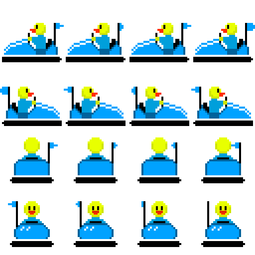
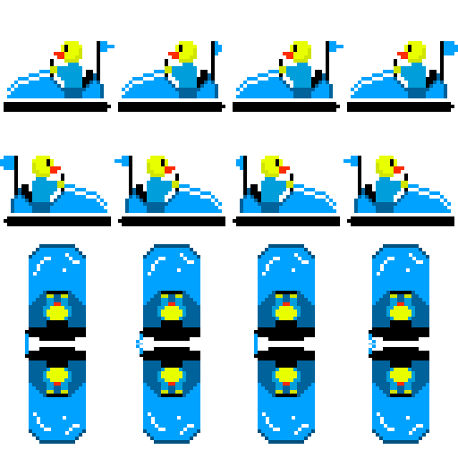
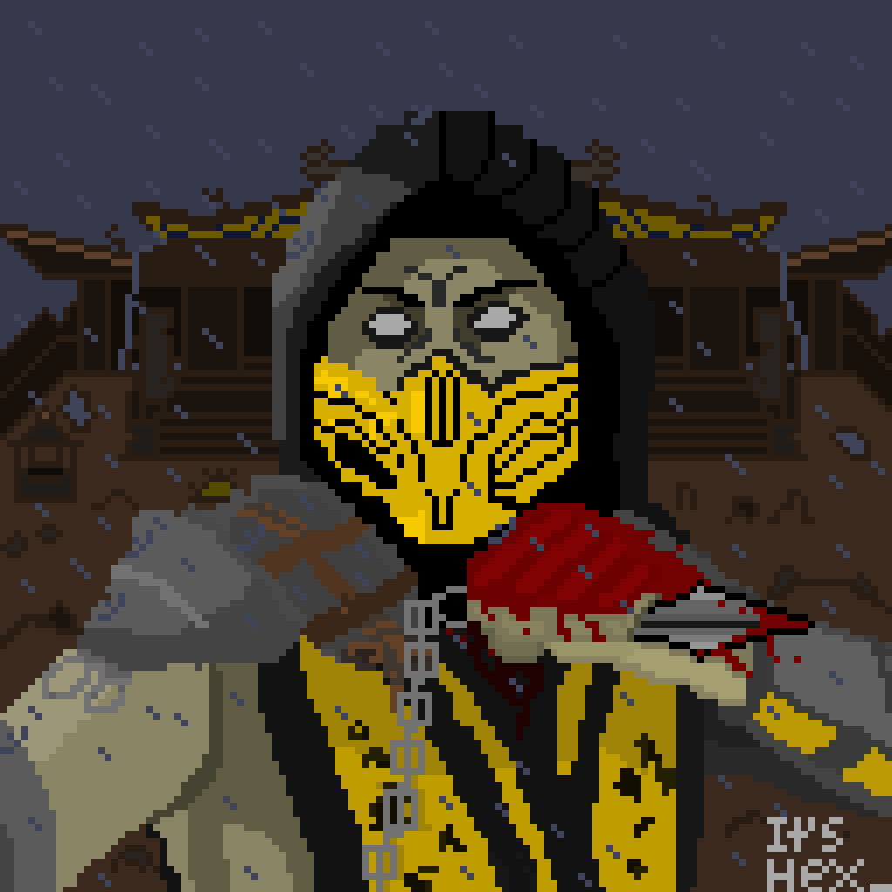

# Creative-Works-
A collection of "art" and "content" I have worked on in my spare time. I've only included my more serious or more complete artworks, I've been interested in pixel art for years, but never had the confidence to make lots of art. I've made lots of small sprites here and there, but nothing interesting.

I also have some experience in video editing, particularly (I started out back in the day with Windows Movie Maker, but seriously who uses that anymore) Adobe Premiere Pro. From really cringey CS:GO related videos to 30fps gameplay montages to high school memes, I'm definitely capable of basic editing, but crazy edits would require me to learn. Also, I really don't think you'd want to see my embarrassing videos so please take my word for my skill level.

This is probably the most serious graphic design I've ever done. The story is that my father had started a new business so I designed the logo with some guidance to how it was supposed to look. Everything here is made by myself using Adobe Illustrator.

This was an unused pixel art sprite-sheet for a HSC SDD major project. Like all my pixel-art I use Aseprite. However, I had since changed the project idea and this sprite-sheet was never in proper use for anything. It was originally intended for a "2D Rocket League", but at the time my skill levels were not capable of making such a game. The animation does work though, it is clear the flag moves as if wind were blowing on it. 

So I've always been a fan of Mortal Kombat and at the end of 2018 when I had seen the out of the blue new game trailer drop, I was pretty hyped enough to actually make some fan-art. This was an original "pixel-art adaptation" of a shot from the trailer. Yes, I did draw every single damn pixel by hand (and yes, a mouse).

