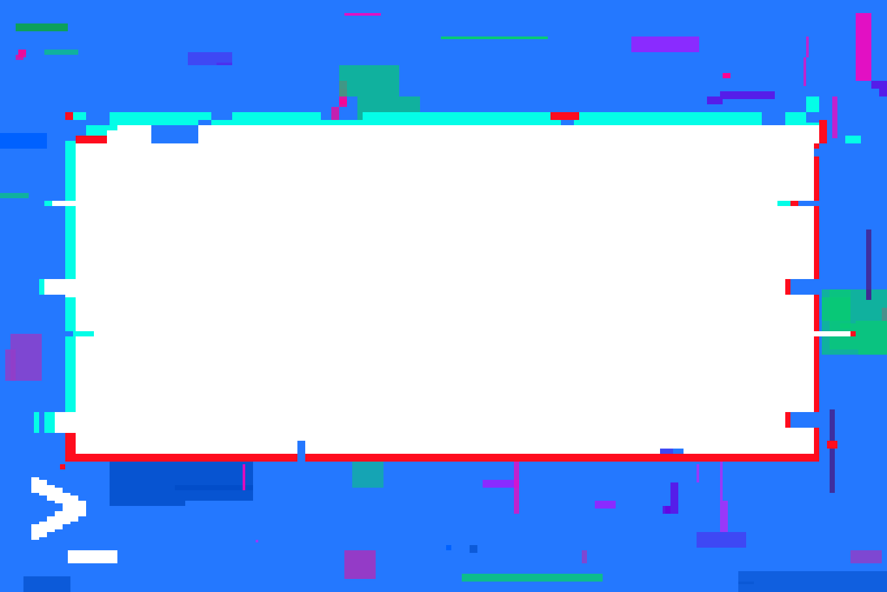

# Creative-Works-

**Software Used and Experience** 
Vector designs: Adobe Illustrator 
Pixel art: Aseprite 
Video editing: Adobe Premiere Pro 
Photo editing: Adobe Photoshop (minor experience) 

Hello! In my spare time I enjoy graphic designing. This was my first serious attempt at graphic design in Adobe Illustrator. The logo was made for my father's watch service business and is still in use today.

I joined CSESOC Creative Subcommittee in 2020 and submitted my first design, used for the annual hoodie competition. This design came in second place.

With COVID-19 diminishing the social aspect of uni, the merch team's designs were mostly made redundant for example here was my submission for CSESOC's scavenger hunt, originally to be given out as a prize to winners.

Here was a t-shirt concept.

I've always enjoyed pixel art and made a simple terminal.

The subcommittee had been thinking about developing a mascot so here was a pixel-art concept sticker.

However, my later designs were later used.  
Here is one of the 3 stickers released by the merch team to be used throughout the future years (keep an eye out during O-Week :D).

CSESOC needed a simplified yet identifiable Event-Coordinator shirt.

I also designed CSESOC's official Halloween display picture, due to the event team being quite full with banner tasks. Not sure why people think I made this in Photoshop, I made everything myself in Adobe Illustrator :)

CSESOC's summer Compclub name tags were based on the unused sticker design above. The theme was "Hack to the future" and I really enjoyed designing the glitch effect so I translated the same design onto the name tag. 

I've made some FPS montages before, but they're quite cringe worth, maybe I'll show later hehe.
